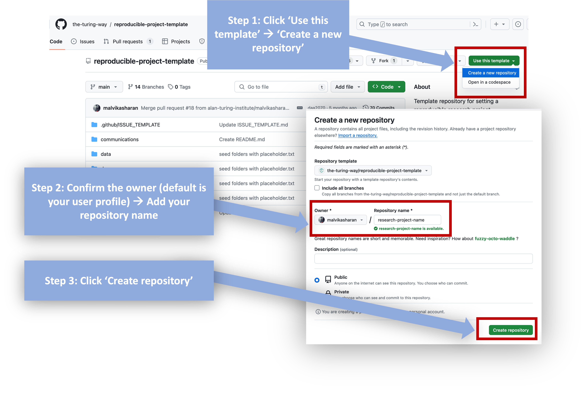

# Fall Prevention and Detectiuon Solutions in Indigenous Population
<!-- ALL-CONTRIBUTORS-BADGE:START - Do not remove or modify this section -->
[](#contributors-)
<!-- ALL-CONTRIBUTORS-BADGE:END -->
Hello 👋\
Welcome to the Bridging Tradition and Safety project! 🌍✨ A Community-Based Study on Indigenous Footwear and Fall Prevention!\
We're excited to bridge cultural heritage 🧑‍🎨 and safety innovations 🛡️ to support Indigenous communities.


## Project Description 🌍👟
Our project investigates the role of Indigenous footwear in fall prevention, focusing on the slip resistance of traditional designs compared to Western footwear. Falls are a pressing health issue, especially among older adults, and are even more concerning within Canada’s Indigenous communities, where fall-related hospitalizations are higher.

Through collaborative engagement with Indigenous communities, we aim to gain insights into their footwear preferences, cultural values, and experiences with slips and falls. Our goal is to co-create solutions that blend cultural integrity with modern safety features, ensuring the findings are practical and meaningful for Indigenous populations.

### What Makes This Project Special, Useful, and Exciting 🌟
Bridging Tradition and Innovation: We honor the cultural significance of traditional footwear while improving safety with modern slip-resistant designs.\
Community-Based Collaboration: Indigenous elders, cultural knowledge holders, and fall prevention experts guide the research, making it a truly inclusive project.\
Holistic Approach with Two-Eyed Seeing: By integrating Indigenous and Western knowledge, we bring together two ways of knowing to create well-rounded solutions.\
Direct Impact on Public Health: Our recommendations will enhance safety and reduce fall risks, making everyday activities safer for Indigenous populations.




**Image Description:**

Your streamlined project setup is just three steps away:
* Step 1: Click 'Use this template' on the top right-hand side. Follow it up by clicking 'Create a new repository.'
* Step 2: In the subsequent window, set the 'owner' (yourself or a GitHub organisation) and give your project repository a descriptive name.
* Step 3: Finalise by clicking 'Create repository' at the bottom right-hand side.

After creating your own copy of this repository, you can edit or delete existing files and folders, or add new ones as per your needs.

<!--If reusing this repository, delete this section -->
## Vision 🌠

A world where Indigenous communities thrive safely without compromising cultural traditions. We aim to redefine fall prevention by incorporating Indigenous wisdom into footwear design, making it accessible, safe, and culturally meaningful.
```
# Project Quick Start

*Add Badges/GitHub shields, which are clickable buttons that provide concise actions related to the project.*

*A sentence summarising what to expect from this repository*  

## Vision and Mission

- **Vision:** One sentence capturing the project's overarching vision.
- **Mission:** One sentence defining the project's goals and target audience.

## About

Motivation and background in a nutshell.

## Roadmap & Milestones

- **Goals:** Clear overview of overarching and short-term goals.
- **Outcomes:** Description of expected results and deliverables.

## The Team

- **Members:** List of team members and their roles in the project.
- **Roles & Responsibilities:** [Team Directory](link-to-directory) outlines roles, responsibilities and their ways of working.

## Contributing

- **Guidelines:** [Contribution Guidelines](link-to-guidelines) for contributors.
- **Code of Conduct:** [Code of Conduct](link-to-coc) ensures a respectful project environment.
- **Resource Plans:** Details on available resources and recommended practices for the project team.

## Licensing

Clearly define the license under which the repository's work is shared.
(Example: This project is licensed under the MIT License - see the LICENSE.md file for details.)

## Citing & Acknowledgement

- **Citation Instructions:** How to cite the project.
- **Acknowledgment:** Recognising contributions by different members.

## Contact

- **Reach Out:** Contact details for questions, feedback, or ideas.

```


<!--If reusing this repository, delete this section -->

## Repo Structure

Inspired by [Cookie Cutter Data Science](https://github.com/drivendata/cookiecutter-data-science).

```
├── LICENSE
├── README.md          <- The top-level README for users of this project.
├── CODE_OF_CONDUCT.md <- Guidelines for users and contributors of the project.
├── CONTRIBUTING.md    <- Information on how to contribute to the project.
├── data
│   ├── processed      <- The final, canonical data sets for modeling.
│   └── raw            <- The original, immutable data dump.
│
├── docs               <- A default Sphinx project; see sphinx-doc.org for details
│
├── models             <- Trained and serialized models, model predictions, or model summaries
│
├── notebooks          <- Jupyter notebooks. The naming convention is a number (for ordering),
│                         the creator's initials, and a short `-` delimited description, e.g.
│                         `1.0-jqp-initial-data-exploration`.
│
├── reports            <- Generated analysis as HTML, PDF, LaTeX, etc.
│   └── figures        <- Generated graphics and figures to be used in reporting
│
├── project_management <- Meeting notes and other project planning resources
│
├── src                <- Source code for use in this project.
│   │
│   ├── data           <- Scripts to download or generate data
│   │   └── make_dataset.py
│   │
│   ├── models         <- Scripts to train models and then use trained models to make
│   │   │                 predictions
│   │   ├── predict_model.py
│   │   └── train_model.py
│   │
│   └── visualisation  <- Scripts to create exploratory and results-oriented visualisations
│       └── visualise.py
└──
```

**Maintainers**

This repository has been set up and maintained by Shay Chavoshian to support this work.

As an open source repository, anyone beyond these teams is very welcome to reuse this template for setting up their projects.

*Please create [an issue](../../issues) to share references or ideas related to the development of this project.*

🎯 Roadmap
---

### Checklist for the project 

- [ ] Add a README file
- [ ] Add a [CONTRIBUTING](CONTRIBUTING.md) file
- [ ] Add a [LICENSE](LICENSE.md)
- [ ] Add a [Code of Conduct](CODE_OF_CONDUCT.md)
- [ ] Install [all-contributors](https://allcontributors.org/) bot
- [ ] .gitignore file (choose from a template)
- [ ] Issue templates
    - [ ] Optionally Install [Welcome/behavior](https://github.com/behaviorbot/welcome) bot (see The Turing Way [config](https://github.com/alan-turing-institute/the-turing-way/blob/main/.github/config.yml))
- [ ] Create a directory with files for project management (meetings, reports, proposals)
- [ ] Create a directory with files for communications
- [ ] Create a directory for research analysis
- [ ] Create a directory for research results/outcomes to share (?)
- [ ] Create a directory for ethics approval and project policies
- [ ] Create a directory with files for stakeholders' info and the nature of engagement
- [ ] Connect repo with Zenodo
- [ ] Add cff file for citation
- [ ] Add badges

📫 Contact
---

For any organisation-related queries or concerns, you can directly reach out to Malvika Sharan by emailing [msharan@turing.ac.uk](mailto:msharan@turing.ac.uk).

♻️ License
---

This work is licensed under the MIT license (code) and Creative Commons Attribution 4.0 International license (for documentation).
You are free to share and adapt the material for any purpose, even commercially,
as long as you provide attribution (give appropriate credit, provide a link to the license,
and indicate if changes were made) in any reasonable manner, but not in any way that suggests the
licensor endorses you or your use and with no additional restrictions.

🤝 Acknowledgement
---

This repository has been created for anyone to reuse -- please attribute us as:
> This repository uses the template created and maintained by *The Turing Way* team members and shared under CC-BY 4.0 for reuse: https://github.com/alan-turing-institute/reproducible-project-template.

## Contributors ✨

Thanks goes to these wonderful people ([emoji key](https://allcontributors.org/docs/en/emoji-key)):

<!-- ALL-CONTRIBUTORS-LIST:START - Do not remove or modify this section -->
<!-- prettier-ignore-start -->
<!-- markdownlint-disable -->
<table>
  <tbody>
    <tr>
      <td align="center"><a href="http://malvikasharan.github.io/"><br /><sub><b>Malvika Sharan</b></sub></a><br /><a href="#ideas-malvikasharan" title="Ideas, Planning, & Feedback">🤔</a> <a href="#content-malvikasharan" title="Content">🖋</a></td>
      <td align="center"><a href="https://github.com/EKaroune"><br /><sub><b>Emma Karoune</b></sub></a><br /><a href="#ideas-EKaroune" title="Ideas, Planning, & Feedback">🤔</a> <a href="https://github.com/alan-turing-institute/reproducible-project-template/commits?author=EKaroune" title="Documentation">📖</a></td>
      <td align="center"><a href="http://www.aleesteele.com"><br /><sub><b>Anne Lee Steele</b></sub></a><br /><a href="#ideas-aleesteele" title="Ideas, Planning, & Feedback">🤔</a> <a href="https://github.com/alan-turing-institute/reproducible-project-template/commits?author=aleesteele" title="Documentation">📖</a></td>
      <td align="center"><a href="https://github.com/vhellon"><br /><sub><b>Vicky Hellon</b></sub></a><br /><a href="#ideas-vhellon" title="Ideas, Planning, & Feedback">🤔</a> <a href="https://github.com/alan-turing-institute/reproducible-project-template/commits?author=vhellon" title="Documentation">📖</a></td>
      <td align="center"><a href="http://jending.com"><br /><sub><b>Jennifer Ding</b></sub></a><br /><a href="#content-dingaaling" title="Content">🖋</a> <a href="https://github.com/alan-turing-institute/reproducible-project-template/commits?author=dingaaling" title="Documentation">📖</a> <a href="#ideas-dingaaling" title="Ideas, Planning, & Feedback">🤔</a></td>
      <td align="center"><a href="http://lappland.io"><br /><sub><b>Hilmar Lapp</b></sub></a><br /><a href="https://github.com/alan-turing-institute/reproducible-project-template/issues?q=author%3Ahlapp" title="Bug reports">🐛</a></td>
    </tr>
  </tbody>
</table>

<!-- markdownlint-restore -->
<!-- prettier-ignore-end -->

<!-- ALL-CONTRIBUTORS-LIST:END -->

This project follows the [all-contributors](https://github.com/all-contributors/all-contributors) specification. Contributions of any kind welcome!
